# AWS EC2 Active Directory Lab

Standing up a Windows domain controller on AWS EC2, managing users/groups via PowerShell, and running the work through a ticketing workflow (Zendesk) to simulate a real IT operations process.

## Project Goal
This project simulates a small-business IT environment: provisioning a Windows Server domain controller in AWS, managing the user lifecycle via PowerShell, and processing each change through a ticketing system, to demonstrate proven experience with level 1 sysadmin/help-desk workflows end to end.

## Architecture

Domain Controller/ AMI: Windows Server 2022 Base t3.medium
Domain: corplab.local
VPC and subnet: The setup for this lab includes one VPC and inside that, one public subnet.
Contained in the public subnet is the domain controller and a domain joined client with an ip given through DCHP.
The internet gateway also only lets in RDP from my own IP address for both EC instances.

### Diagram
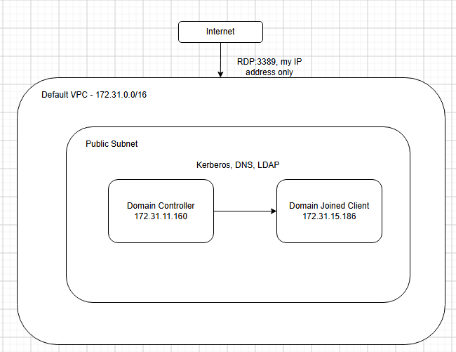
This diagram outlines of the lab as well as showing what connections are allowed between each EC2 isntance.

#### Something to note
In a legitimate production environment outside of this lab, I would not expose my 3389 port directly for RDP and instead using something like a bastion host.

## Provisioning the EC2 instances

Provisioned Windows 2022 Base t3.medium and t3.small with security groups that allow for RDP from my IP. both instances are in seperate security groups but for this lab have the same rules. 

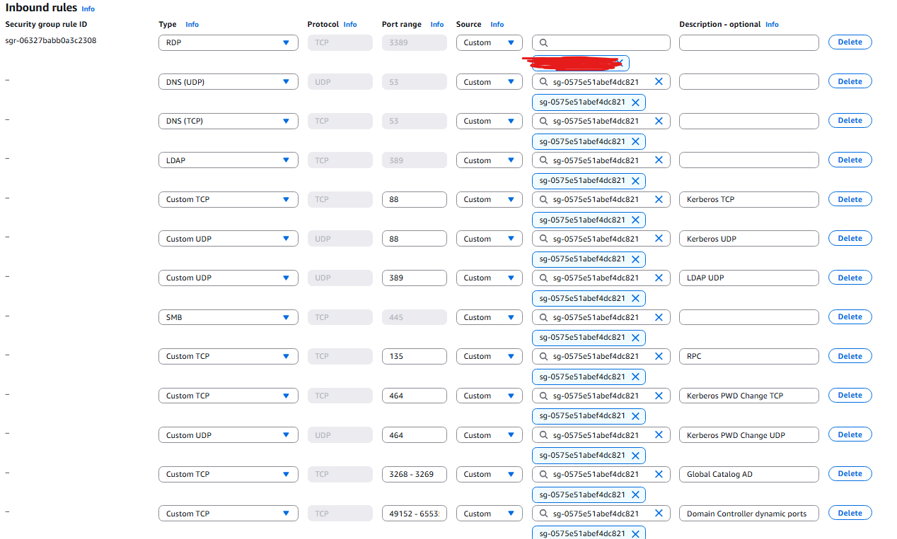

In order for the client EC2 instance to connect into the domain controller, the inbound rules for the domain controller need to be updated so that when the domain-joined client wants to connect and log in to an account on the DC. It is possible for this to happen outside of using my personal IP. The security group of the client is set as the source so that each individual IP doesn't have to be added if there were more than 1 client.

## RDP into the EC2 instance to begin the Lab

Connecting with the EC2 instance through RDP. This represents how in some tech scenarios you may have to RDP into some machines to do changes. However RDP is not the most secure and their should be precautions made to ensure proper authentication and security.

## Powershell Command Processing (full user lifecycle)

#### Installing windows AD DS

#### Promoting to a new Forest with the Domain Name as corplab.local

This step reboots the server so you will have to log back in with RDP as the administrator for the instance.
#### Post Promotion Verification
running these 3 lines of script in the AD to ensure promotion was successful

#### Taking an AMI of the Instance
Getting an image at this stage of the lab is important in case problems occur and it is required to go back to when the Domain Controller was just promoted.

#### Creating OU Structure
Creating an OU structure for IT, Sales and HR to try and represent a more corporate environment within a lab. It is important to have different organisation untis within to be able to organise network resources like users, groups and computers.

#### Creating a Single User
Creating a user called JaneSmith within the Sales OU branch to showcase the ability to add a single user through active directory

#### Creating and Adding User to Security Group
Important to have a security group as it is an object that allows for the collection of accounts to be sorted into manageable units to assign permissions.

#### Modify a User

Important to be able to modify users to show appropriate information, could be related to tickets which can be tracked or gives info on the account itself.

#### Reset a Password/ Unlock an Account
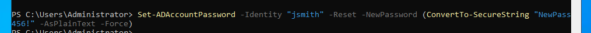
Showcasing the ability to reset a password.

Unlocking an account incase a user becomes locked out for getting the password wrong too many times.

#### Disable/ Re-enable an Account

In cases where the account shouldnt be deleted but disabled.

#### Move a User Between OUs
Moving a user between OUs e.g. if they are moved to a different apartment or team
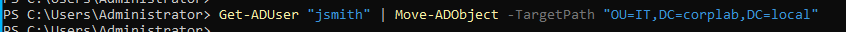

#### Delete a user

When an account needs to be deleted.

#### Bulk create users from a csv

In cases where multiple users need to be added at once, it is possible to use a csv and a powershell script (as seen in scripts/bulkcsvaddition.ps1)

#### Audit after adding accounts

Using the commands in powershell in scripts/audittoreports.ps1 to be able to show the users added.

### Porting Domain Joined Client into the Domain Controller and Signin

#### Setting Preferred DNS Server

#### Add-Computer 
Ran in the client powershell terminal: Add-Computer -DomainName "corplab.local" -Credential (Get-Credential) -Restart
This adds the computer to the Domain Controller and will ask you to log in throught the Get-Credential call. You will have to log in as the administrator account of the client PC.

#### Issues Encountered
There were RDP forced password change issues when trying to RDP into the jdoe account meaning a newpassword had to be set. This wouldn't occur if it wasn't done via rdp as you would just be prompted to change the password after using the temp password. It was also required for a net localgroup to be made on the client ec2 instance for the CORPLAB\jdoe account as it would also not let me RDP into that account if i did not add the account to the localgroup.

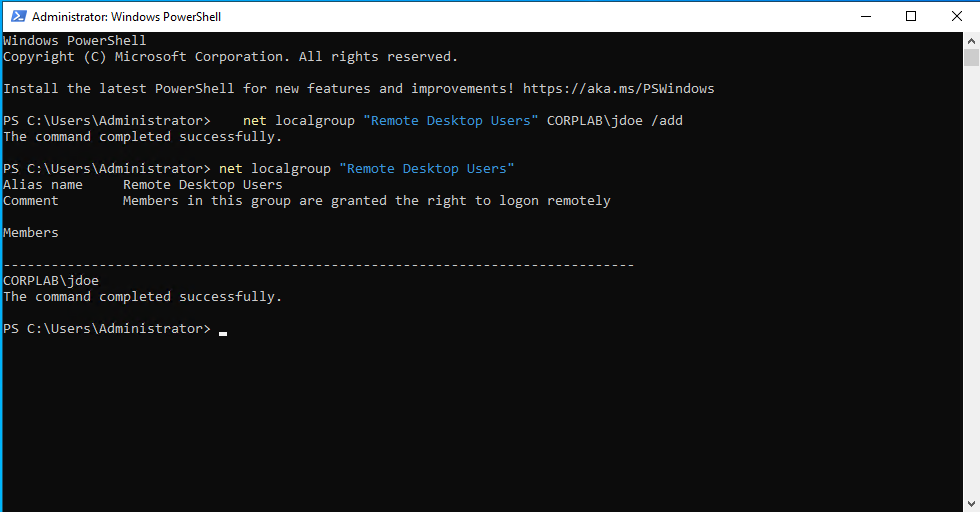

#### RDP and Log-in to an Account

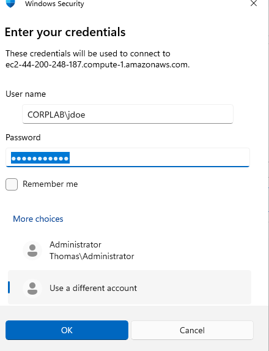

Done through RDP into the EC2 client instance, selecting different user and logging in through the username CORPLAB\jdoe with the password set in the domain controller. 
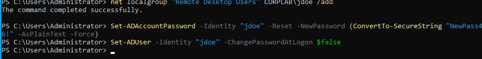

#### Confirming Jdoe Logged In

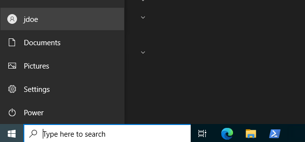

Running the whoami command in powershell to confirm the account that is signed in.
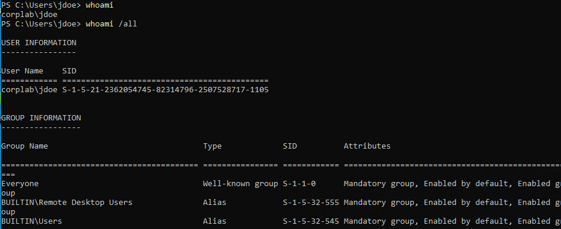

## ZenDesk Ticketing

This aims to build and demonstrate skills related to it support and or helpdesk roles using ZenDesk as a ticketing medium to showcase the applied skills learned throughout this lab/project.

Something to note with the zendesk tickets is that without creating fake emails to log into for each requester all the information suhc as the description come from me. However I still attempt to make the flow of tickets as accurate as possible to a real enivronment through having a description with internal notes on how the job was completed, with it being solved and closed with a public reply to the requester. 

#### Ticket Mapping Table
| Ticket | Task	| Screenshot |
|---|---|---|
| #1 | Provision domain controller | 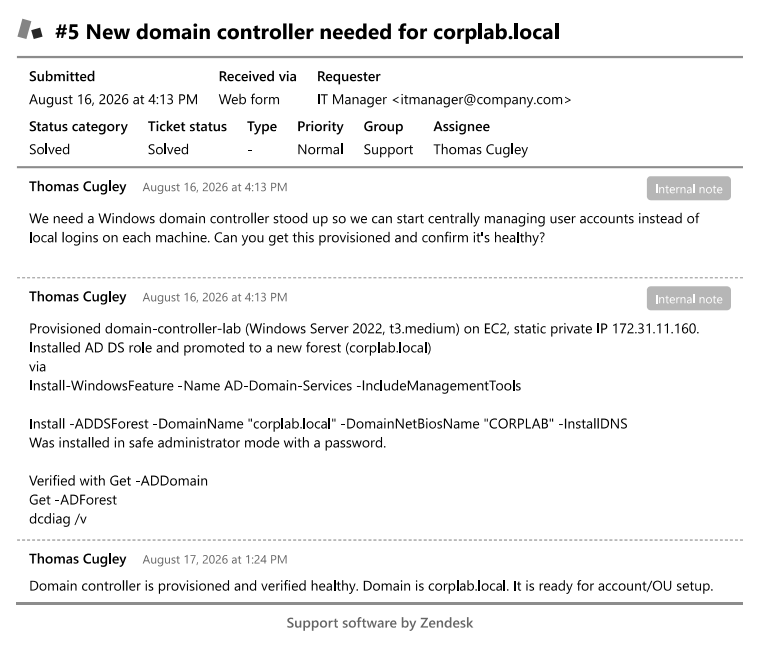 |
| #2 | Build OU structure | 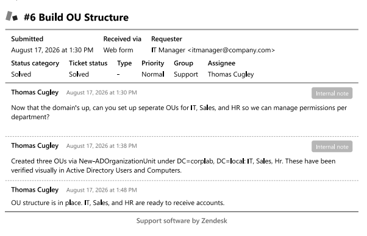 |
| #3 | New hire Sales | 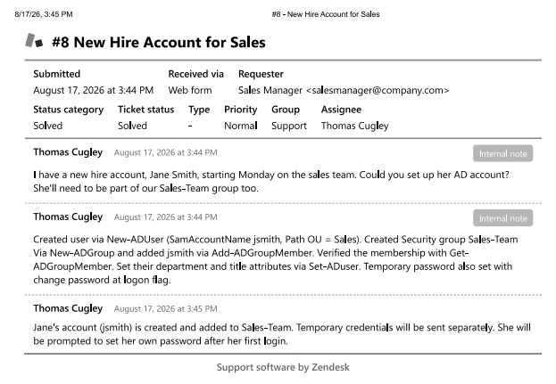 |
| #4 | Bulk onboarding | 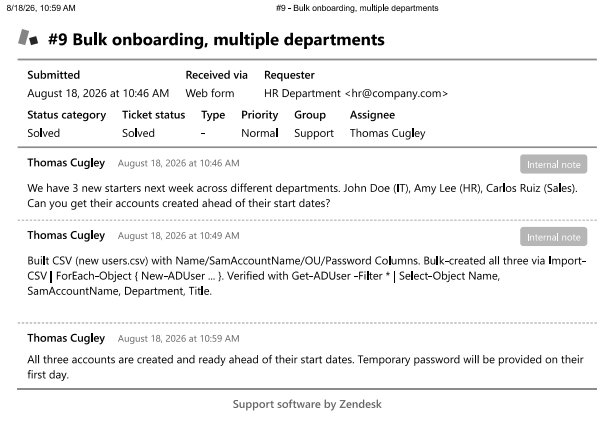 |
| #5 | Temporary account disable | 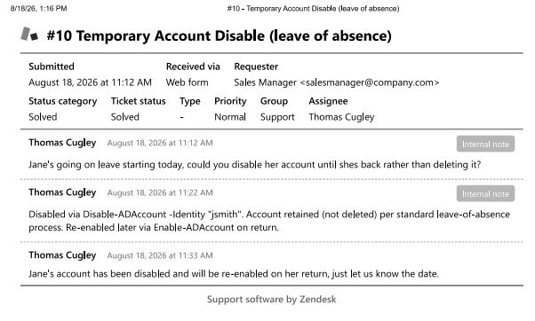 |
| #6 |  Domain-join CLIENT01 | 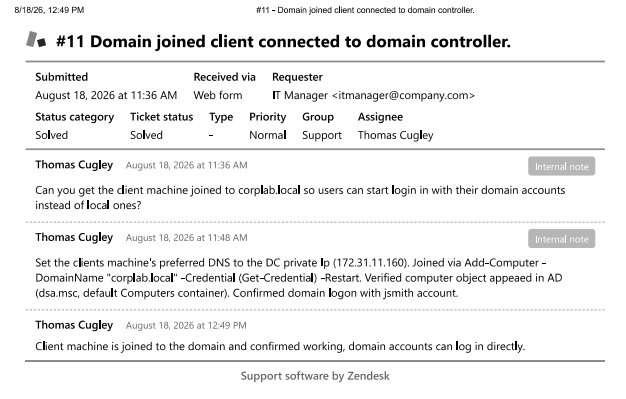 |
| #7 | Offboarding account deletion | 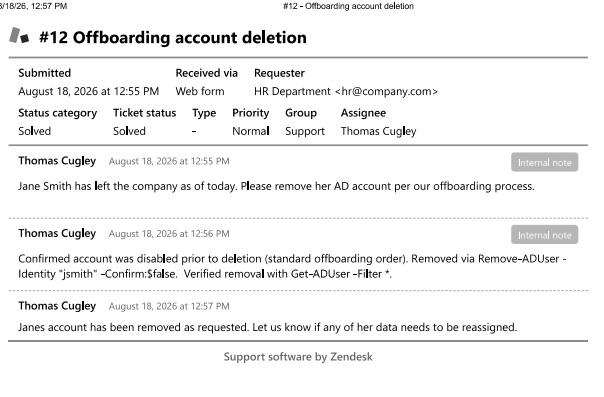 |

## Clean up/ cost management
When finished with the lab, stop and terminate the instances. If you set termination protection then you need to change the protection setting before termination. The zendesk trial was free for the ticketing part of this lab and the AWS bill was only $4.83 at the moment i terminated both instances.

## Skills Demonstrated

#### Windows Server and Active Directory
 - Active Directory Domain Services installation and forest promotion
 - Domain and OU design (ogrnisational strutcture planning, not just default setup)
 - User lifecycle management: create, modify, disable and enable, move between OUs, delete
 - Security group (AD group) creation and membership management
 - Password management: unlock, change policies and resets
 - Bulk user provisioning via CSV import
 - Domain join of client machine, including local group permission management
 - AD health verification (dcdiag, get-ADDomain, Get-ADForest)

#### Powershell
 - Scripting the full AD user/ computer lifecycle rather than relying on GUI tools.
 - CSV Driven bulk operations
 - Reporting/ auditing via filtered Get-AD* queries

#### AWS and Cloud Infrastructure
 - EC2 provisioning
 - VPC/ subnet networking fundamentals
 - Security group design, least privelege, rules.
 - Static/ private IP management
 - AMI snapshotting for environment recovery
 - RDP access management with awareness to security trade-offs

#### Troubleshooting
 - Diagnosing and resolving a real RPC/ security group connectivity issue
 - Diagnosing the RDP/ NLA forced password change conflict.
 - Correctly distingushing credential contexts
#### Documentation
 - Structured technical writing with reproducible steps
 - Screenshots paired with rationale
 - Honest Documentation of failures and fixes

## Lessons Learned/ What I'd do differently
 - When setting password policies to be changed on login, ensure i don't have to rdp into that account later into the lab because it caused issues and I had to go back and fix it.
 - If I plan to RDP into a client user, i need to add them to a local group that allows for rdp under that specific server or I would keep getting errors
 - When learning how to use Zendesk, it was interesting to learn that even if i create a ticket through a client, unless i was willing to create a fake email, I can't use their side to message for the lab so I would have to clarify that in my documentation
 

