# AWS EC2 Active Directory Lab

Standing up a Windows domain controller on AWS EC2, managing users/groups via PowerShell, and running the work through a ticketing workflow (Zendesk) to simulate a real IT operations process.

## Table of Contents

## Project Goal
This project simulates a small-business IT environment: provisioning a Windows Server domain controller in AWS, managing the user lifecycle via PowerShell, and processing each change through a ticketing system, to demonstrate proven experience with level 1 sysadmin/help-desk workflows end to end.

## Architecture

Domain Controller/ AMI: Windows Server 2022 Base t3.medium
Domain: corplab.local
VPC and subnet: The setup for this lab includes one VPC and inside that, one public subnet.
Contained in the public subnet is the domain controller and a domain joined client with an ip given through DCHP.
The internet gateway also only lets in RDP from my own IP address for both EC instances.

#### Something to note
In a legitimate production environment outside of this lab, I would not expose my 3389 port directly for RDP and instead using something like a bastion host.

## Provisioning the EC2 instances

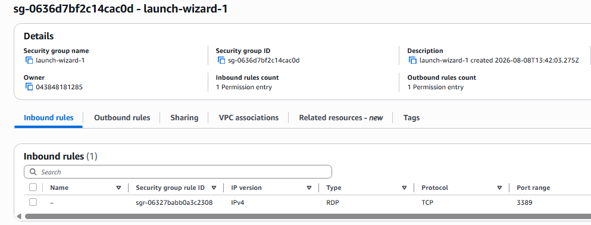

Provisioned Windows 2022 Base t3.medium and t3.small with security groups that allow for RDP from my IP. both instances are in seperate security groups but for this lab have the same rules. 

## RDP into the EC2 instance to begin the lab

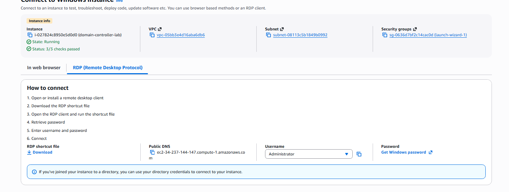

Connecting with the EC2 instance through RDP. This represents how in some tech scenarios you may have to RDP into some machines to do changes. However RDP is not the most secure and their should be precautions made to ensure proper authentication and security.

## Powershell Command Processing (full user lifecycle)

#### Installing windows AD DS
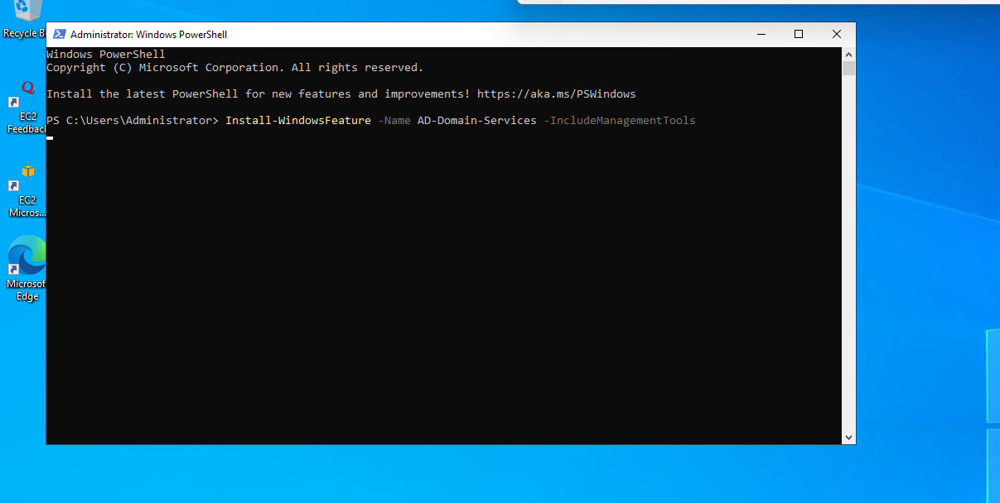

#### Promoting to a new forest with the domain name as corplab.local
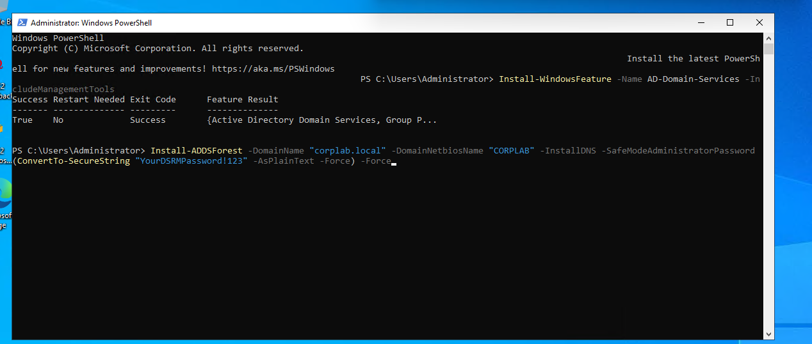
This step reboots the server so you will have to log back in with RDP as the administrator for the instance.
#### Post promotion verification
running these 3 lines of script in the AD to ensure promotion was successful
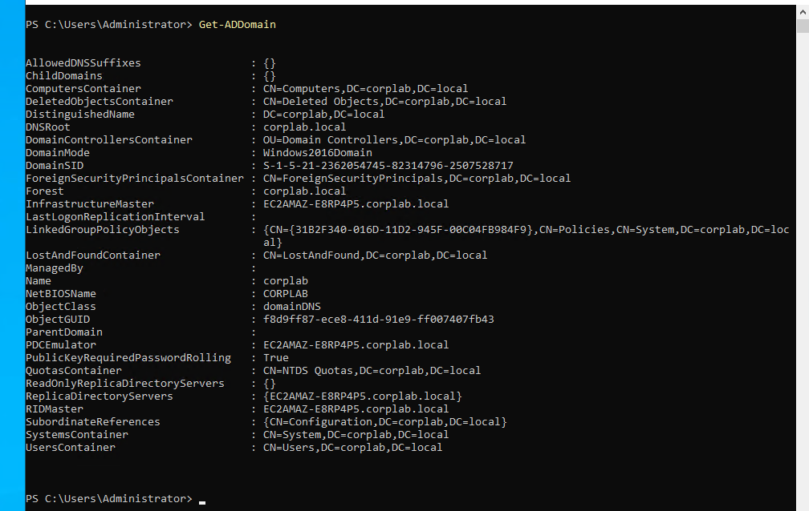
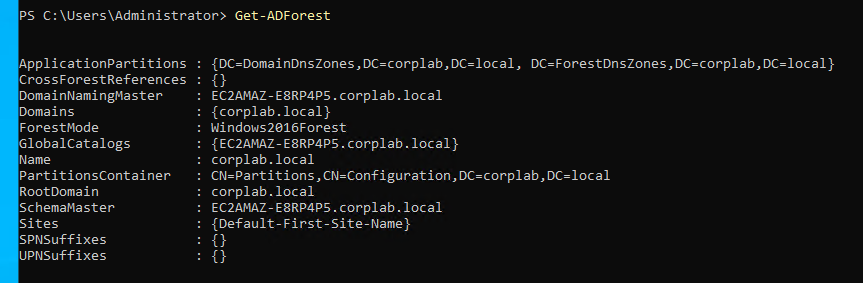
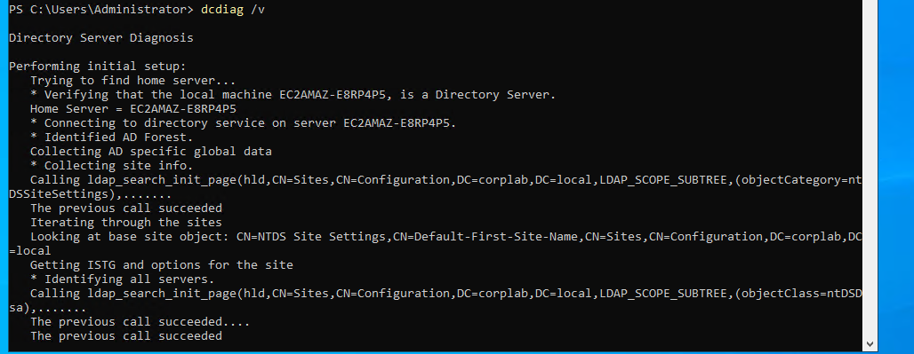

#### Taking an AMI of the instance
Getting an image at this stage of the lab is important in case problems occur and it is required to go back to when the Domain Controller was just promoted.
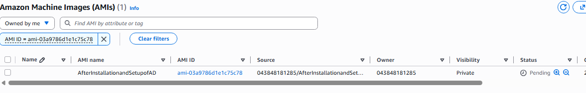

#### Creating OU Structure
Creating an OU structure for IT, Sales and HR to try and represent a more corporate environment within a lab. It is important to have different organisation untis within to be able to organise network resources like users, groups and computers.
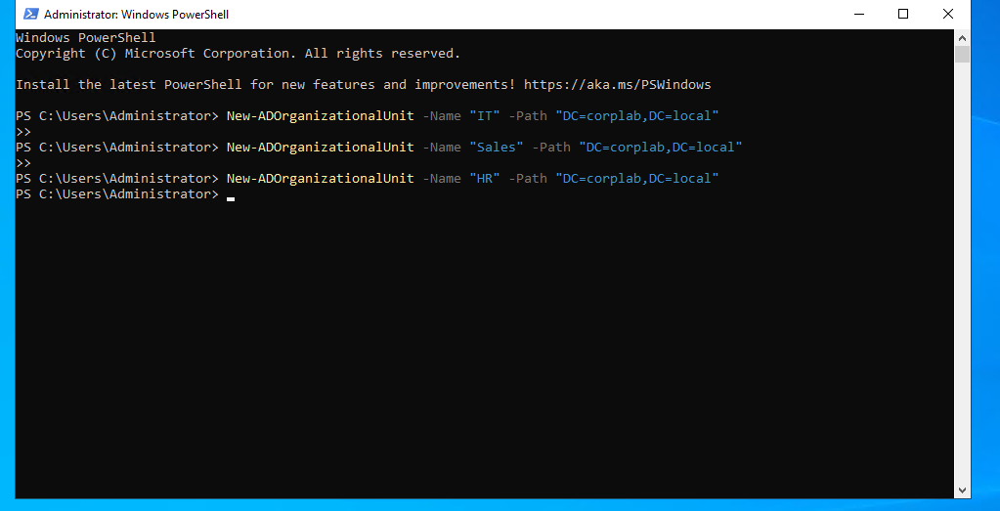
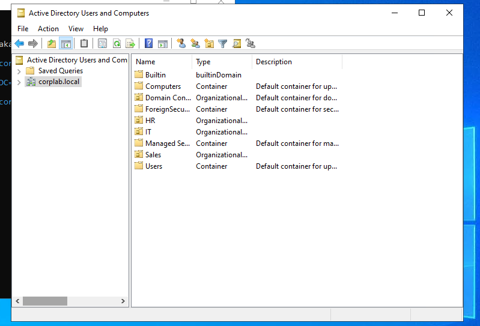

#### Creating a single user
Creating a user called JaneSmith within the Sales OU branch to showcase the ability to add a single user through active directory
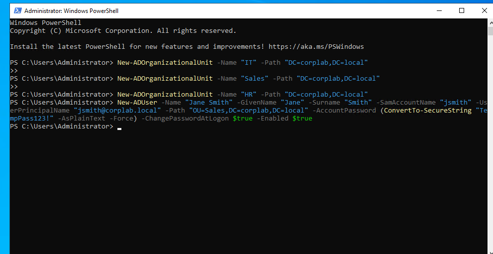

#### Creating and adding user to security group
Important to have a security group as it is an object that allows for the collection of accounts to be sorted into manageable units to assign permissions.
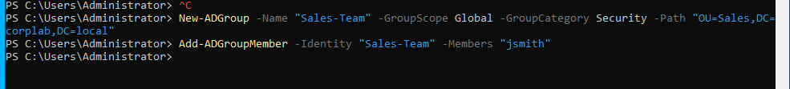

#### Modify a user
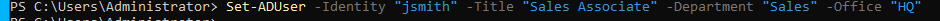
Important to be able to modify users to show appropriate information, could be related to tickets which can be tracked or gives info on the account itself.

#### Reset a Password/ unlock an account

#### Disable/ re-enable an account
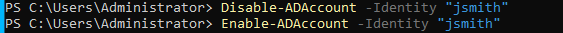
In cases where the account shouldnt be deleted but disabled.

#### move a user between OUs

#### Delete a user
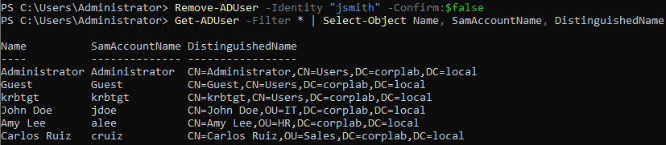
When an account needs to be deleted.

#### Bulk create users from a csv
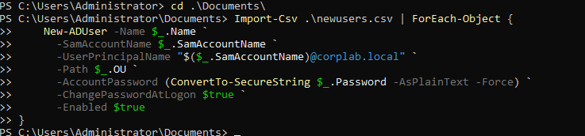
In cases where multiple users need to be added at once, it is possible to use a csv and a powershell script (as seen in scripts/bulkcsvaddition.ps1)

#### Audit after adding accounts
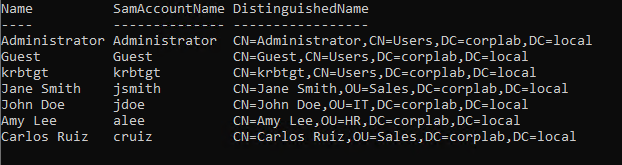

Using the commands in powershell in scripts/audittoreports.ps1 to be able to show the users added.

